# S800 智能联网时钟系统

基于 TI TM4C1294NCPDT 和 Python PyQt5 的智能时钟课程项目。S800 板可独立完成时钟、日期、闹钟和按键设置，PC 上位机通过 USB 虚拟串口提供控制、状态监视与数字孪生界面。

> 系统设计、协议说明、扩展功能和演示内容见对应简介 PDF。

## 项目结构

```text
.
├── mcu/
│   ├── Inc/                            芯片头文件
│   ├── Driverlib/                      TivaWare 驱动库
│   ├── src/main.c                      MCU 自编程序
│   └── obj/exp.axf                     UniFlash 烧写文件
├── images/                             运行截图
├── pc_host/
│   ├── main.py                         程序入口与业务控制
│   ├── astral_helper.py                昼夜模式计算
│   ├── chart_widget.py                 数据看板组件
│   ├── log_store.py                    事件数据存储
│   ├── ntp_helper.py                   NTP 网络对时
│   ├── protocol.py                     串口协议解析
│   ├── serial_worker.py                后台串口通信
│   ├── twin_panel.py                   数字孪生组件
│   ├── ui_main_window.py               PyQt 主窗口界面类
│   ├── weather_helper.py               天气获取与转换
│   ├── main_window.ui                  Qt Designer 界面文件
│   └── requirements.txt                Python 依赖
├── docs/
│   ├── 大作业524442910013-江彦佐.pdf    简介文档
│   └── 演示视频.mp4
└── README.md                           烧写与运行说明
```

## 开发环境

- Windows 10 或 Windows 11
- Code Composer Studio UniFlash
- TI TM4C1294NCPDT 开发板
- Python 3.11.9
- 串口参数：115200，8N1，无流控
- 协议容错：大小写不敏感、空格容错、缩写识别

### Python 依赖

上位机完整依赖见 `pc_host/requirements.txt`：

| 包 | 版本要求 | 用途 |
|---|---|---|
| PyQt5 | ==5.15.9 | GUI 框架与 Qt Designer 工具链 |
| pyserial | >=3.5 | 串口通信 |
| ntplib | >=0.4.0 | NTP 网络对时 |
| requests | >=2.28 | 天气 API 请求 |
| astral | >=3.2 | 日出日落计算（昼夜模式） |
| matplotlib | >=3.5 | 数据看板绘图 |
| pyttsx3 | ==2.99 | 倒计时语音播报 |
| pywin32 | >=306 | Windows SAPI 语音接口备用 |

## MCU 烧写

使用 UniFlash 烧写 `mcu/obj/exp.axf`：

1. 使用 Micro USB 连接 S800 板并打开 UniFlash。
2. 在主界面展开 `New Configuration`。
3. 在 `Enter Device Name` 中输入 `TM4C1294NCPDT`，选择 `TIVA TM4C1294NCPDT`。
4. 确认 `Selected Connection` 为 `Stellaris In-Circuit Debug Interface`，然后点击 `Start`。
5. 在左侧选中 `Program`，在 `Load Image` 中点击 `Browse`。
6. 将文件类型切换为 `All Files (*.*)`，选择项目中的 `mcu/obj/exp.axf`。
7. 可勾选 `Run Target After Program Load/Flash Operation`，使程序烧写后自动运行。
8. 控制台出现绿色的 `[SUCCESS] Program Load completed successfully.` 即表示烧写成功。

## PC 上位机安装与运行

在项目根目录按所用终端执行。

PowerShell：
```powershell
cd pc_host
py -3.11 -m venv .venv
.venv\Scripts\Activate.ps1
python -m pip install -r requirements.txt
python main.py
```

CMD：
```bat
cd pc_host
py -3.11 -m venv .venv
.venv\Scripts\activate.bat
python -m pip install -r requirements.txt
python main.py
```

### 常见问题

- `py -3.11` 找不到 Python：安装 Python 3.11.9，并在安装时勾选 `Add Python to PATH`。可用 `py -0p` 检查已安装版本。
- PowerShell 提示禁止运行 `Activate.ps1`：执行 `Set-ExecutionPolicy -Scope CurrentUser RemoteSigned` 后重新激活虚拟环境。
- 运行时报 `ModuleNotFoundError`：确认命令行前缀出现 `(.venv)`，然后重新执行 `python -m pip install -r requirements.txt`。
- `pyuic5` 或 Qt Designer 不可用：确认使用 Python 3.11，并已安装 `requirements.txt` 中的 `pyqt5-tools`。
- 串口打开失败或被占用：关闭串口助手、其他上位机程序或占用该 COM 口的软件，再点击“刷新”并重新打开。
- NTP 对时或天气获取失败：检查网络连接；程序会记录错误并保持 GUI 运行，天气请求失败后会自动重试。
- 发送原始协议时报“仅限 ASCII”：串口协议要求 ASCII 字符，命令和参数不要包含中文或全角符号。

程序启动后选择 S800 对应的 COM 端口并点击“打开”。连接成功后可使用控制面板、数字孪生镜像、日志、网络对时、天气和数据看板。

## 运行截图

### 必做功能

#### 开机画面

展示数码管和 8 位 LED 开机自检，显示学号后 8 位即42910013、姓名yanzuo及版本号v1.0。

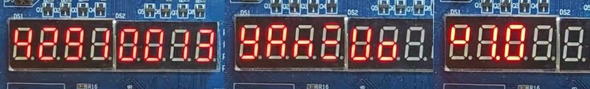

#### 时钟、日期与显示切换

展示 DISP 切换后的日期画面以及 8 位数码管小数点效果。

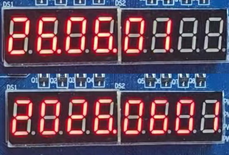

#### 编辑、闹钟与 LED 指示

展示闹钟编辑状态及对应 LED 辅助指示。

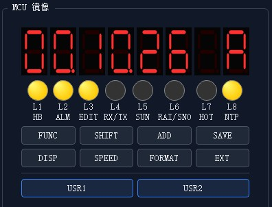

#### PC 控制与数字孪生

展示串口连接、数字孪生面板、控制区、状态栏和收发日志。

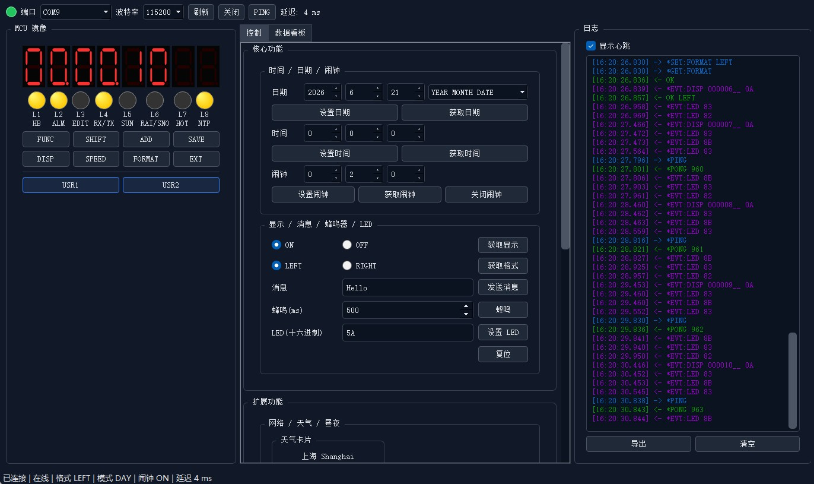

#### 软硬件双向同步

展示开发板与 PC 数码管、LED 状态同步。

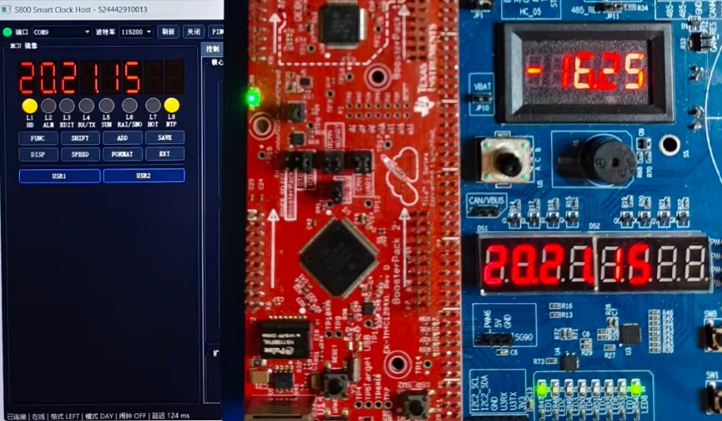

#### 串口协议与收发日志

展示缩写命令、大小写混合命令、空格容错及带时间戳和颜色区分的收发日志。

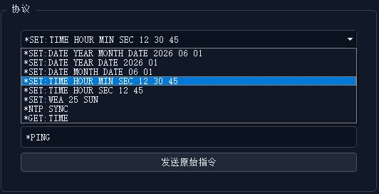

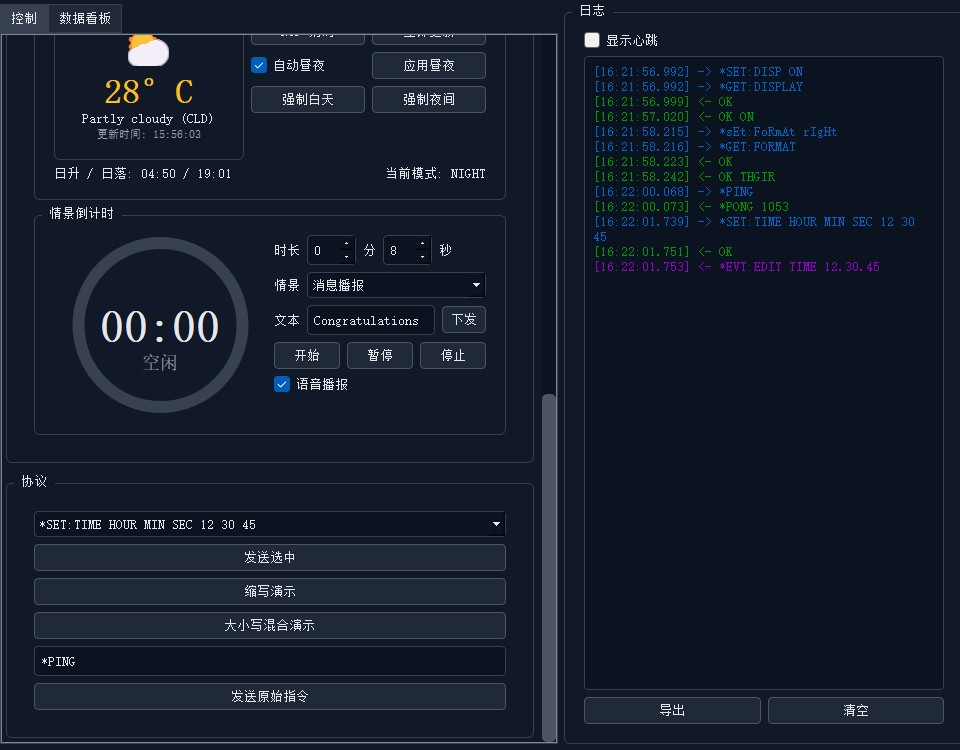

#### 异常处理与错误提示

展示串口打开失败、NTP 网络请求失败和非 ASCII 协议文本等异常弹窗，错误发生后 GUI 保持运行。

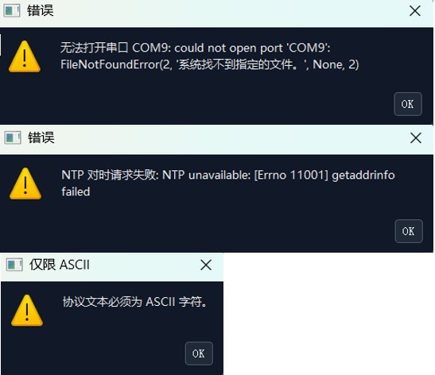

### 扩展及自主功能

#### NTP 对时与天气

展示天气卡片、NTP 对时入口、自动昼夜控制和日出日落信息。

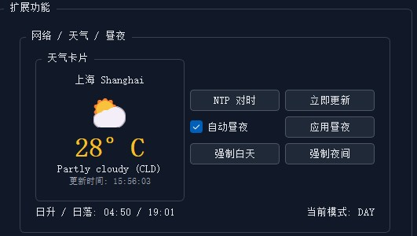

#### DAY 与 NIGHT 模式

对比 DAY 完整时间显示与 NIGHT 仅显示时分、仅保留心跳 LED 的效果。

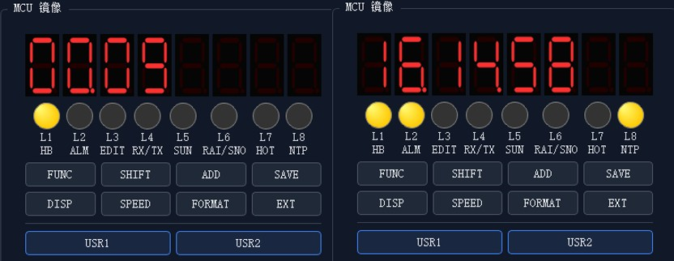

#### 数据可视化看板

展示闹钟触发时间、NTP 误差和按键热度三张图表。

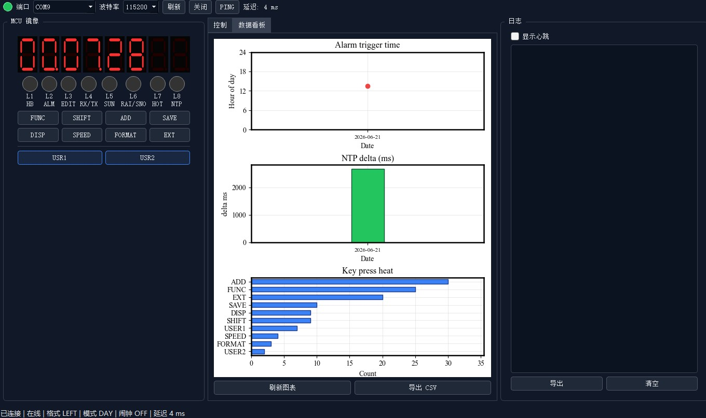

#### 情景倒计时

展示倒计时控制区、PC 进度环、板上倒计时显示及完成情景。

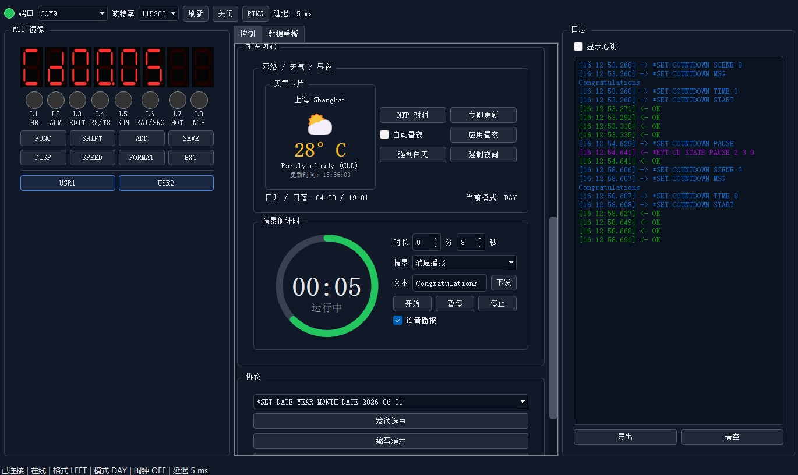
