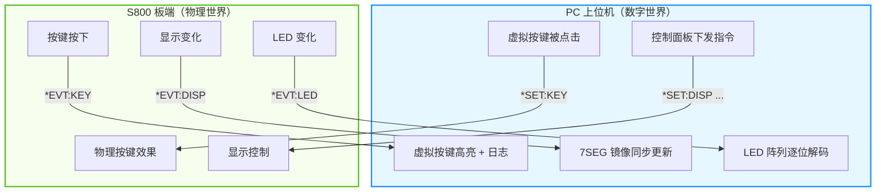
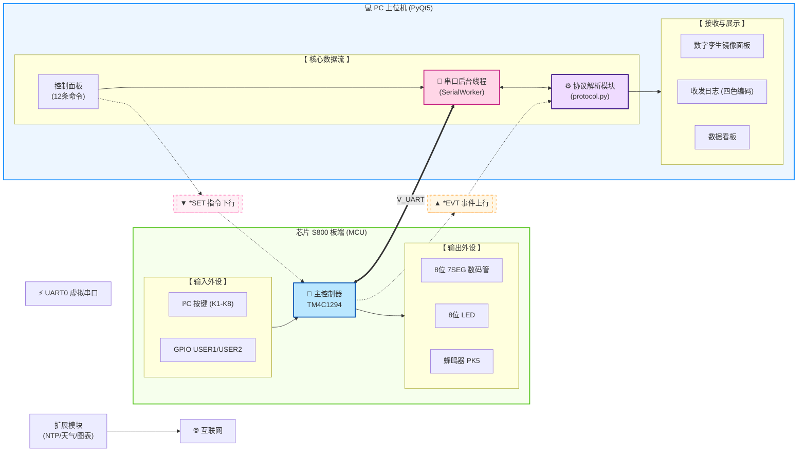

# 🌐 智能联网时钟系统

> **Smart Networked Clock System** — S800 硬件板卡 × PC 上位机，1:1 数字孪生双向协同

[](https://www.ti.com/product/TM4C1294NCPDT) [](https://www.keil.com/uvision/) [](https://www.python.org/) [](https://www.riverbankcomputing.com/software/pyqt/) [](LICENSE)

---

## 📋 目录

1. [项目概述](#1-项目概述)
2. [工程目录结构](#2-工程目录结构)
3. [系统架构](#3-系统架构)
4. [开发环境与依赖](#4-开发环境与依赖)
5. [编译与运行指南](#5-编译与运行指南)
6. [系统核心功能特性](#6-系统核心功能特性)
7. [串口通信协议](#7-串口通信协议)
8. [按键映射表](#8-按键映射表)
9. [LED 辅助指示](#9-led-辅助指示)
10. [扩展功能详解](#10-扩展功能详解)
11. [测试建议](#11-测试建议)
---

## 1. 项目概述

### 1.1 系统简介

本系统由 **S800 硬件板卡（MCU 端）** 与 **PC 上位机软件** 共同搭建，是一台既能 **本地独立运行**、又可通过 **USB 虚拟串口与 PC 实现双向协同** 的智能数字时钟系统。

| 特性 | 说明 |
|------|------|
| 🕐 **独立运行** | S800 板在不连接 PC 的情况下，独立完成时钟走时、闹钟、按键设置、流水显示等全部本地功能 |
| 🔗 **远程协同** | PC 端通过 USB 虚拟串口（115200 8N1）与 S800 板通信，实现远程控制、状态监视、镜像显示等扩展能力 |
| 🪞 **数字孪生** | PC 上位机提供与 S800 板 **1:1 镜像** 的数字孪生面板（8 位 7SEG + 8 位 LED + 8 位按键 + USER1/USER2），构成双向同步闭环 |
| 🏗️ **工程质量** | 两端协议统一、容错可靠（大小写不敏感 + 空格容错 + 缩写支持），具备工程化提交质量 |

### 1.2 核心特色：数字孪生双向同步



- 板上任何按键、显示、LED 状态变化 **即时反映** 到 PC（双向延迟 < 200ms）
- PC 上点击虚拟按键 **等效于按下板上物理按键**（`*SET:KEY` 下行回路）
- `*EVT:DISP` 与 `*EVT:LED` 每秒发送一次（即使无变化），既作增量上报又作 **1Hz 全量心跳**
- **夜间模式同步**：NIGHT 模式下仅点亮时分 4 位、LED 仅保留心跳，PC 镜像自动跟随

---

## 2. 工程目录结构

```
大作业524442910013-江彦佐/
├── mcu/                                    # MCU 端工程, Keil uVision5
│   ├── inc/                                # 硬件寄存器头文件
│   ├── driverlib/                          # TivaWare 外设驱动库
│   ├── src/                                # 源代码目录
│   │   └── main.c                          # ★ 自编代码集中于此
│   ├── obj/                                # 编译输出目录
│   │   └── exp1.axf                        # ★ 必交的可烧写固件文件
│   ├── RTE/                                # Keil Run-Time Environment
│   ├── hw.uvprojx                          # Keil 工程文件
│   └── hw.uvoptx                           # Keil 工程选项文件
├── pc_host/                                # PC 上位机工程
│   ├── ui/                                 # Qt Designer UI 源文件
│   │   └── main_window.ui                  # 主窗口布局
│   ├── images/                             # 运行截图
│   ├── main.py                             # ★ 程序入口
│   ├── ui_main_window.py                   # pyuic5 生成的 UI 界面类
│   ├── serial_worker.py                    # 后台串口收发线程
│   ├── protocol.py                         # 协议解析与帧处理模块
│   ├── twin_panel.py                       # 数字孪生镜像面板
│   ├── ntp_helper.py                       # NTP 网络对时辅助模块 [E1]
│   ├── weather_helper.py                   # wttr.in 天气获取模块 [E2]
│   ├── astral_helper.py                    # Astral 日出日落计算模块 [E3]
│   ├── chart_widget.py                     # Matplotlib 数据可视化图表 [E4]
│   ├── log_store.py                        # 事件日志持久化存储
│   ├── requirements.txt                    # 依赖清单
├── docs/                                   # 文档目录
│   ├── 大作业524442910013-江彦佐.pdf        # ★ 简介报告
│   └── 演示视频.mp4                         # ★ 带旁白演示视频
└── README.md                               # ★ 本说明文档
```

---

## 3. 系统架构

### 3.1 架构框图



### 3.2 关键数据流

| 方向 | 报文类型 | 数据内容 | 触发方式 |
|------|----------|----------|----------|
| ⬆ **上行**（板→PC） | `*EVT:KEY` | 物理按键按下 | 用户操作 |
| ⬆ **上行**（板→PC） | `*EVT:DISP` / `*EVT:LED` | 显示+LED 1Hz 心跳 | 定时 1 秒 |
| ⬆ **上行**（板→PC） | `*EVT:ALARM` / `*EVT:EDIT` | 闹钟/编辑事件 | 系统事件 |
| ⬆ **上行**（板→PC） | `*PONG <uptime_s>` | 心跳应答 | PC *PING 触发 |
| ⬇ **下行**（PC→板） | `*SET:*`（12 条） | 远程控制指令 | 用户操作 |
| ⬇ **下行**（PC→板） | `*GET:*`（5 种） | 状态查询 | 用户操作 |
| ⬇ **下行**（PC→板） | `*PING` | 心跳检测 | 定时 1 秒 |
| 🔄 **镜像回路** | `*SET:KEY` → `*EVT:DISP/LED` | 虚拟按键→板→显示变化→镜像更新 | 闭环双向 |

---

## 4. 开发环境与依赖

### 4.1 MCU 端（S800 板卡）

| 项目 | 说明 |
|------|------|
| **编译环境** | Keil MDK uVision **5.x**（ARM Compiler 5 或 6） |
| **硬件平台** | S800 板卡（基于 TI **TM4C1294NCPDT** MCU，主频 120 MHz） |
| **驱动库** | TivaWare™ Peripheral Driver Library（位于 `mcu/driverlib/`） |
| **调试接口** | 板载 ICDI 调试器（DEBUG 口），USB 虚拟串口（UART 口） |
| **通信参数** | 波特率 **115200**, 数据位 **8**, 无校验 (**N**), 停止位 **1**, 无流控 |
| **烧录工具** | Keil 内置 Flash Download（F8）或 TI LM Flash Programmer |

### 4.2 PC 端（上位机）

| 项目 | 说明 |
|------|------|
| **语言版本** | Python **3.11.x**（推荐 3.10+） |
| **GUI 框架** | PyQt5 ≥ 5.15 |
| **串口通信** | pyserial ≥ 3.5 |
| **包管理** | pip + `requirements.txt`（虚拟环境推荐） |

### 4.3 Python 依赖清单

**`pc_host/requirements.txt` 核心依赖：**

```ini
# ===== 必装依赖（核心功能 §4.1）=====
PyQt5 >= 5.15             # GUI 框架：主窗口/控制面板/镜像面板/日志
pyserial >= 3.5            # 串口通信：COM 扫描/后台收发/心跳检测

# ===== 扩展依赖（扩展功能 §4.2）=====
ntplib >= 0.4.0            # E1: NTP 网络对时（aliyun/ntsc NTP 服务器）
requests >= 2.28           # E2: wttr.in 天气 API HTTP 请求
astral >= 3.2              # E3: 基于经纬度的日出日落时间计算
matplotlib >= 3.5          # E4: 闹钟/对时/按键三类图表绘制

# ===== 传递依赖（由以上包自动安装，仅列出关键项）=====
numpy >= 2.4               # matplotlib 数值计算后端
pillow >= 12.2             # 图像处理支持
python-dateutil >= 2.9     # 日期解析与格式化
```

> 📦 **完整版本**见 `pc_host/requirements.txt`。

---

## 5. 编译与运行指南

### 5.1 MCU 端 — 编译与烧录

#### ① 打开工程

1. 启动 **Keil uVision5**
2. 菜单栏 **Project** → **Open Project…**
3. 定位到 `mcu/hw.uvprojx`，双击打开

#### ② 编译工程

1. 菜单栏 **Project** → **Build Target**（快捷键 `F7`）
2. 确认 Build Output 窗口显示：

```
Build target 'Target 1'
compiling main.c...
linking...
Program Size: Code=XXXX RO-data=XXXX RW-data=XXXX ZI-data=XXXX
"mcu\Objects\exp1.axf" - 0 Error(s), 0 Warning(s).
```

3. 编译产物自动生成：`mcu/Objects/exp1.axf`

#### ③ 烧录到 S800 板

1. 用 USB 线连接 S800 板 **DEBUG 口** 到 PC
2. Keil 菜单栏 **Flash** → **Download**（快捷键 `F8`）
3. Build Output 显示 `Erase Done.` + `Programming Done.` + `Verify OK.`
4. S800 板自动复位，开始运行开机画面

#### ④ 硬件引脚映射确认

| 资源 | MCU 引脚 / I²C 地址 | 备注 |
|------|---------------------|------|
| **蜂鸣器** | **PK5** | 高电平响，低电平停 |
| **数码管位选** | TCA6424 `OUTPUT_PORT2` | I²C 地址 `0x22`，`0x01` 为最左位 |
| **数码管段选** | TCA6424 `OUTPUT_PORT1` | 共阳编码 |
| **LED1–LED8** | PCA9557 P0–P7 | I²C 地址 `0x18`，低电平点亮，LED1 最左 |
| **SW1–SW8（K1–K8）** | TCA6424 `INPUT_PORT0` | 低电平按下，对应 FUNC/SHIFT/ADD/SAVE/DISP/SPEED/FORMAT/EXT |
| **USER1** | **PJ0** | GPIO 输入，低电平按下 |
| **USER2** | **PJ1** | GPIO 输入，低电平按下 |
| **UART0** | PA0 (RX) / PA1 (TX) | USB 虚拟串口，115200 8N1 |

---

### 5.2 PC 端 — 安装与启动

#### ① 创建 Python 虚拟环境（推荐）

```powershell
cd D:\hw26-0013\pc_host
python -m venv .venv
```

#### ② 激活虚拟环境

**Windows PowerShell:**
```powershell
.\.venv\Scripts\activate
```

**Windows CMD:**
```cmd
.venv\Scripts\activate.bat
```

**Linux / macOS:**
```bash
source .venv/bin/activate
```

#### ③ 安装依赖

```bash
pip install -r requirements.txt
```

> ⚠️ 若 PyQt5 安装缓慢或失败，可切换国内镜像：
> ```bash
> pip install PyQt5 -i https://pypi.tuna.tsinghua.edu.cn/simple
> pip install -r requirements.txt -i https://pypi.tuna.tsinghua.edu.cn/simple
> ```

#### ④ 启动上位机
```bash
python main.py
```

#### ⑤ 连接 S800 设备

1. 用 USB 线连接 S800 板 **UART 口** 到 PC（注意不是 DEBUG 口）
2. 在上位机 **状态栏** 下拉框中选择对应 COM 口（如 `COM9`）
3. 点击 **Connect** 按钮
4. 观察状态栏变化：
   - 🔴 `Disconnected` → 🟢 `Connected`
   - 心跳延迟开始刷新（`Latency: XX ms`）
   - FORMAT / MODE / ALARM 状态从 `*PONG`/`*EVT` 自动同步

---

### 5.3 快速验证流程

| 步骤 | 操作 | 预期结果 |
|:--:|------|----------|
| 1 | S800 板上电 | 开机画面：`88888888` → 空白 → 学号 → 姓名拼音 → 版本号 `V1.0` → 正常走时 |
| 2 | 连接串口 | PC 状态栏显示 🟢 Connected + `Latency: XX ms` |
| 3 | PC 点击虚拟按键 `DISP` | S800 板显示切换（时间↔日期↔年份），PC 7SEG 同步 |
| 4 | 按下 S800 板物理按键 | PC 日志区显示 `*EVT:KEY xxx`（对应按键名） |
| 5 | PC 发送 `*SET:MSG Hello` | S800 板数码管流水显示 `HELLO`，PC 7SEG 同步 |
| 6 | PC 发送 `*SET:BEEP 500` | S800 板蜂鸣器短促鸣叫 500ms |
| 7 | 按 S800 板 `USER1` | PC 自动触发 NTP 对时流程 |
| 8 | 按 S800 板 `USER2` | 数码管短显天气 5 秒（需 PC 先下发天气数据） |

---

## 6. 系统核心功能特性

### 6.1 S800 板端功能（§3 全部必做）

| 编号 | 功能模块 | 关键要求 |
|:--:|----------|----------|
| **3.1** | **开机画面** | 8 位数码管 + 8 位 LED 全亮→全灭，闪烁 ≥1 次；显示学号后 8 位并闪烁 1 次；显示姓名拼音（≤8 字符）并闪烁 1 次；显示版本号 ≥1 秒后进入正常时钟 |
| **3.2** | **时钟与日期** | 默认显示 `HH.MM.SS`，按键切换 `YY.MM.DD` / `YYYY.MMDD`；闰年与月末进位（28/29/30/31）正确；1ms 系统时基驱动，秒不丢不抖；支持 `*SET:DISP OFF` 整屏熄灭 |
| **3.3** | **流水显示** | 内容 > 8 位时按固定速率流水；方向 `LEFT`/`RIGHT` 可控（`*SET:FORMAT` 或 FORMAT 键）；速度 2 级可调（SPEED 键切换）；小数点跟随：左→右用本位小数点，右→左用下一位小数点 |
| **3.4** | **闹钟功能** | 时分秒全等触发；蜂鸣器节奏式响铃（响-停-响），持续 ≤10 秒自动停止；响铃中按 FUNC 即时停止（FUNC 优先级高于编辑模式切换）；LED 指示使能/响铃状态 |
| **3.5** | **按键编辑状态机** | 短按 FUNC 循环切换编辑模式「日期→时间→闹钟→退出」；SHIFT 循环高亮（闪烁）当前编辑字段；ADD 循环加 1 含进位与范围钳制；SAVE 或长按 FUNC 保存退出（等效）；5 秒无操作超时退出不保存；防反跳/连击：1 秒内 ≥3 次不丢键 |
| **3.6** | **LED 辅助指示** | 8 位 LED 全部使用，包含：系统心跳、闹钟状态、编辑模式、串口收发活动四类必需指示 + 扩展指示（天气/对时） |
| **3.7** | **按键完整映射** | 8 个 I²C 按键（K1–K8）+ 2 个 GPIO 按键（USER1/USER2），短按/长按双功能，共 10 个按键名称用于协议通信 |

### 6.2 PC 上位机必做功能（§4.1）

| 编号 | 功能 | 关键要求 |
|:--:|------|----------|
| **P1** | **串口管理与状态栏** | 自动扫描 COM 口列表（Refresh 按钮）；连接/断开控制后台串口线程；1 秒间隔 `*PING` 心跳，实时计算并显示延迟（ms）；状态栏四要素：连接状态、FORMAT（LEFT/RIGHT）、MODE（DAY/NIGHT）、ALARM（ON/OFF） |
| **P2** | **控制面板** | 覆盖全部 **12 条命令** 的可视化下发；提供 **≥3 种参数组合下拉框**（如 `*SET:DATE YEAR MONTH DATE` / `YEAR DATE` / `MONTH DATE`）；提供缩写演示按钮（`MIN`/`MINU`/`MINUT`/`MINUTE`）；提供大小写混合演示按钮（`*set:time`/`*SET:TIME`） |
| **P3** | **数字孪生镜像面板** | 软件自绘 8 位 7SEG（含小数点精确复现）+ 8 位 LED（逐位解码亮灭）+ 8 个普通按键 + USER1/USER2（独立可点击控件）；SEG 根据 `*EVT:DISP <8字符> <dpHex>` 实时渲染；LED 根据 `*EVT:LED <hex2>` 逐位更新；点击虚拟按键下发 `*SET:KEY <NAME>`；夜间模式仅点亮时分 4 位 + LED 仅保留心跳；1Hz 心跳自动校准，镜像延迟 **< 200ms**；支持长按（按下不松持续上报） |
| **P4** | **收发日志** | 时间戳 + 方向标记 + **四色严格编码**（🟡发送 TX / 🟢应答 OK+EVT / 🔴错误 ERR / 🔵系统 SYS）；QPlainTextEdit 自动滚动到底部；支持 **导出为 HTML** 文件 |
| **P5** | **异常处理** | 串口占用/断开弹窗提示；协议解析异常日志红色高亮；NTP/天气网络超时弹窗 + 日志记录；S800 板 `ERROR` 应答日志红色标记；GUI 主线程永不崩溃 |

### 6.3 自主增加功能（§4.3 · 高分必选 · 8 分）

| 功能 | 关键要求 |
|------|----------|
| **专注倒计时** | 基于相对时长的倒计时，与绝对时间闹钟互补。PC 端提供 QSpinBox 设置 1–3599 秒，点击按钮下发 `*SET:COUNTDOWN <sec>`；S800 板收到后数码管显示 `CDMMSS`，第 4 位小数点常亮作标志；归零后自动复用蜂鸣器节奏响铃 10 秒，上报 `*EVT:COUNTDOWN_DONE`；倒计时期间闹钟功能独立可用互不干扰 |

**四段说明（动机—设计—实现—演示）** 详见简介 PDF §5。

### 6.4 技术硬指标

| 指标 | 要求 | 验证方式 |
|------|------|----------|
| 显示稳定性 | 无闪烁、无不连续、亮度均匀 | 目测 7SEG 动态扫描 |
| 按键响应 | 1 秒内连续按 ≥3 次不丢键 | 快速连击测试 |
| 编辑超时 | 5 秒无操作自动退出且不保存 | 进入编辑后静置 |
| 串口容错 | 大小写不敏感 + 多空格/Tab + 缩写合法 | 发送混合命令验证 |
| FORMAT RIGHT | 应答与显示逆序，小数点位置正确跟随 | `*GET:TIME` 验证 |
| 镜像完整性 | 8SEG + 8LED + 8按键 + USER1/USER2 四组组件 | PC 面板目测 |

---

## 7. 串口通信协议

### 7.1 基本参数

| 参数 | 值 |
|------|-----|
| **波特率** | 115200 |
| **数据位** | 8 |
| **校验位** | None |
| **停止位** | 1 |
| **流控** | 无 |
| **编码** | ASCII（7-bit 可见字符） |
| **行结束符** | `\r\n` 或 `\n`（任一均可） |
| **单帧最大长度** | 64 字节（不含行结束符） |

### 7.2 容错三件套

| 规则 | 说明 | ✅ 合法示例 | ❌ 非法示例 |
|------|------|-------------|-------------|
| **大小写不敏感** | 命令、子命令、参数项的字面量大小写均合法 | `*set:time HOUR 12`、`*SET:TIME hour 12` | — |
| **空格容错** | 命令与参数、参数与参数之间允许 1 或多个空格/Tab | `*SET:  TIME   HOUR   12` | — |
| **缩写规则** | 大写字母为必输部分，小写字母可省略 | `MIN` / `MINU` / `MINUT` / `MINUTE` | `MI`（缺少大写 N） |

### 7.3 命令总表：PC → S800 板（12 条）

| # | 命令 | 子命令/参数 | 说明 |
|:--:|------|-------------|------|
| 1 | `*RST` | — | 复位时钟/日期/闹钟，DISPLAY=ON, FORMAT=LEFT |
| 2 | `*SET:DATE` | `YEAR` `MONTH` `DATE`（单参或任意组合） | 设置日期 |
| 3 | `*SET:TIME` | `HOUR` `MINute` `SECond`（单参或任意组合） | 设置时间 |
| 4 | `*SET:ALARM` | `HOUR` `MINute` `SECond` / `OFF` | 设置闹钟（自动启用），OFF 关闭 |
| 5 | `*SET:DISPlay` | `ON` / `OFF` | 数码管亮灭控制 |
| 6 | `*SET:FORMAT` | `LEFT` / `RIGHT` | 显示与应答方向 |
| 7 | `*SET:MSG` | `<text>`（≤32 字节，保留原大小写） | 滚动消息 |
| 8 | `*SET:BEEP` | `<MS>`（10–5000 ms） | 远程蜂鸣 |
| 9 | `*SET:LED` | `<hex2>`（如 `AA`） | 直接设置 LED 字节 |
| 10 | `*SET:KEY` | `<NAME>`（见 §8 按键映射表） | 模拟按键（不触发 `*EVT:KEY` 回环） |
| 11 | `*SET:MODE` | `DAY` / `NIGHT` | 昼夜模式 [E3] |
| 12 | `*GET` | `DATE` / `TIME` / `ALARM` / `DISPlay` / `FORMAT` | 查询并应答 |
| — | `*PING` | — | 心跳检测 |

**应答格式：**

| 结果 | 格式 | 示例 |
|------|------|------|
| 成功 | `OK [<data>]` | `OK 12.30.45` |
| 命令格式错误 | `ERROR SYNTAX` | 不可识别的命令或子命令 |
| 参数错误 | `ERROR PARAM` | 参数名/值不合法 |
| 数值越界 | `ERROR RANGE` | 参数值超出范围 |
| 长度超限 | `ERROR LEN` | MSG 超过 32 字节 |
| 系统繁忙 | `ERROR BUSY` | 编辑模式中拒绝写操作 |

### 7.4 主动报文：S800 板 → PC

| 报文 | 触发条件 | 说明 |
|------|----------|------|
| `*EVT:KEY <NAME>` | 物理按键按下 | NAME 见 §8（10 项） |
| `*EVT:ALARM` | 闹钟响铃开始 | 蜂鸣器激活 |
| `*EVT:ALARM_OFF` | 闹钟响铃停止 | 自动停止或手动关闭 |
| `*EVT:EDIT <TYPE> <VALUE>` | 本地编辑保存 | TYPE: DATE/TIME/ALARM |
| `*EVT:DISP <8字符> <dpHex>` | 显示变化 **或 1 秒心跳** | `<8字符>` 定长 8（空格填充），`<dpHex>` 2 位 hex（如 `00`/`02`/`80`） |
| `*EVT:LED <hex2>` | LED 变化 **或 1 秒心跳** | 2 位 hex 编码 8 位 LED 状态 |
| `*EVT:MODE <STATE>` | 模式切换 | STATE: DAY/NIGHT |
| `*PONG <uptime_s>` | 应答 `*PING` | uptime_s 为 S800 板上电秒数 |

> ★ **1Hz 全量心跳机制**：`*EVT:DISP` 与 `*EVT:LED` 每秒发送一次（即使内容无变化），PC 据此自动覆盖任何丢失事件，无需重传机制。

### 7.5 FORMAT RIGHT 行为说明

设当前时间为 `12:30:45`：

| 命令 | LEFT 应答 | RIGHT 应答 | 说明 |
|------|-----------|------------|------|
| `*GET:TIME` | `OK 12.30.45` | `OK 54.03.21` | 逆序，小数点按下一位规则跟随 |
| 数码管显示 | `12.30.45` | `54.03.21` | 7SEG 上呈现为逆序 |

### 7.6 参数组合示例

```text
# 日期设置 — 至少 3 种参数组合
*SET:DATE YEAR MONTH DATE 2026 06 01      # 全参数（年+月+日）
*SET:DATE YEAR DATE 2026 01               # 年+日（省略月）
*SET:DATE MONTH DATE 06 01                # 月+日（省略年）

# 时间设置 — 至少 2 种参数组合
*SET:TIME HOUR MIN SEC 12 30 45           # 全参数（时+分+秒）
*SET:TIME HOUR SEC 12 45                  # 时+秒（省略分）

# 闹钟设置
*SET:ALARM HOUR MIN SEC 07 00 00          # 全参数
*SET:ALARM OFF                             # 关闭闹钟
```

### 7.7 完整会话示例

```text
PC:      *PING
S800板:   *PONG 132

PC:      *SET:DATE YEAR MONTH DATE 2026 06 01
S800板:   OK
S800板:   *EVT:EDIT DATE 2026.06.01

PC:      *SET:MSG Hello Clock
S800板:   OK
S800板:   *EVT:DISP HELLO_CL 00            ← 流水显示，空格填充至 8 位

PC:      *GET:TIME
S800板:   OK 12.30.46

PC:      *SET:FORMAT RIGHT
S800板:   OK

PC:      *GET:TIME
S800板:   OK 64.03.21                     ← 逆序应答，小数点按下一位规则跟随

S800板:   *EVT:KEY USER2                   ← 物理按键 USER2 按下
S800板:   *EVT:DISP 25_SUN__ 00            ← USER2 短显天气 5 秒，PC 镜像跟随
```

---

## 8. 按键映射表

### 8.1 I²C 八位按键（TCA6424 INPUT_PORT0）

| 标签 | 位置 | 物理映射 | 短按功能 | 长按功能 |
|------|:--:|----------|----------|----------|
| **FUNC** | K1 | SW1 | 编辑模式切换（日期→时间→闹钟→退出）；响铃中关闹钟 | **保存并退出**（同 SAVE） |
| **SHIFT** | K2 | SW2 | 编辑中切换高亮字段（闪烁指示） | — |
| **ADD** | K3 | SW3 | 当前字段 +1（含进位与范围钳制） | **连加**（≥5 Hz） |
| **SAVE** | K4 | SW4 | **保存并退出编辑** | — |
| **DISP** | K5 | SW5 | 主显示切换：时间 `HH.MM.SS` / 日期 `YY.MM.DD` / 年份 `YYYY.MMDD` | — |
| **SPEED** | K6 | SW6 | 流水速度 **2 级切换**（快/慢） | — |
| **FORMAT** | K7 | SW7 | 流水方向切换（等价 `*SET:FORMAT LEFT/RIGHT`） | — |
| **EXT** | K8 | SW8 | 预留键，仅触发 `*EVT:KEY EXT` | — |

### 8.2 GPIO 独立按键

| 标签 | MCU 引脚 | 电平 | 功能 |
|------|----------|------|------|
| **USER1** | PJ0 | 低电平按下 | 请求 PC 网络对时（触发 `*EVT:KEY USER1`，PC 自动触发与 NTP 按钮等同的对时流程） |
| **USER2** | PJ1 | 低电平按下 | 数码管短显天气 5 秒（需 PC 先下发天气数据到 S800 板；短显期间 `*EVT:DISP` 照常上报，PC 镜像自动跟随） |

### 8.3 协议名称对照

> `*SET:KEY <NAME>` 与 `*EVT:KEY <NAME>` 中 `<NAME>` 取值即上表第 1 列，共 **10 项**：
> `FUNC` / `SHIFT` / `ADD` / `SAVE` / `DISP` / `SPEED` / `FORMAT` / `EXT` / `USER1` / `USER2`

---

## 9. LED 辅助指示

8 位 LED（PCA9557 P0–P7）全部使用，低电平点亮，每位含义如下：

| LED 位 | 编号 | 标签 | 指示功能 | 行为说明 |
|:------:|:----:|------|----------|----------|
| **0** | LED1 | **HB** | 系统心跳 | 1 Hz 翻转亮灭，表示系统正常运行 |
| **1** | LED2 | **ALM** | 闹钟使能/响铃 | 常亮 = 闹钟已设防；快闪 = 正在响铃 |
| **2** | LED3 | **EDIT** | 编辑模式 | 亮 = 当前处于编辑状态 |
| **3** | LED4 | **RX/TX** | 串口收发活动 | 串口收发后亮约 100ms 熄灭 |
| **4** | LED5 | **SUN** | 晴天指示 [E2] | 亮 = 天气为晴（Sunny/Clear） |
| **5** | LED6 | **RAI/SNO** | 雨雪指示 [E2] | 慢闪 = 雨/雪天气 |
| **6** | LED7 | **HOT** | 高温指示 [E2] | 亮 = 温度 ≥ 30°C |
| **7** | LED8 | **NTP** | NTP 对时状态 [E1] | 常亮 = 已同步；慢闪 = 超过 24 小时未同步 |

> **必做四类**：心跳（LED1）、闹钟状态（LED2）、编辑模式（LED3）、串口收发活动（LED4）  
> **扩展指示**：天气编码（LED5+LED6+LED7）、NTP 状态（LED8）

---

## 10. 扩展功能详解

> **扩展功能计入总分 8 分**（E1=2 / E2=3 / E3=2 / E4=1），A/A+ 需至少完成 2 项。

### 10.1 E1 — NTP 网络对时

**功能描述：**
PC 从 NTP 服务器获取标准北京时间，通过协议下发到 S800 板完成精确对时。

**技术实现：**

| 环节 | 说明 |
|------|------|
| **触发方式** | PC 点击 `NTP Sync` 按钮，或 S800 板按下 **USER1** 键（PC 监听 `*EVT:KEY USER1` 自动触发） |
| **NTP 服务器** | 依次尝试 `ntp.aliyun.com` → `cn.ntp.org.cn` → `ntp.ntsc.ac.cn`（容错重试） |
| **下发命令** | `*SET:DATE YEAR MONTH DATE yyyy mm dd` + `*SET:TIME HOUR MIN SEC hh mm ss` + `*NTP SYNC` |
| **LED 指示** | LED8：同步成功 **常亮**，超过 24h 未同步 **慢闪** |
| **错误处理** | 网络超时弹窗提示并写入红色日志 |

**数据流：**
```
S800 USER1 按下 → *EVT:KEY USER1 → PC NTP 请求 → 获取时间 → *SET:DATE+TIME → S800 更新时间 + LED8 同步指示
```

### 10.2 E2 — 天气获取

**功能描述：**
PC 自动获取上海天气（温度 + 天气状况），通过协议下发到 S800 板，S800 板用 LED 编码指示天气类型，按 USER2 可短显天气 5 秒。

**技术实现：**

| 环节 | 说明 |
|------|------|
| **数据源** | `https://wttr.in/Shanghai?format=j1`（免 API Key，免费 JSON 接口） |
| **解析字段** | 当前温度 `temp_C`、天气描述 `weatherDesc[0].value` |
| **天气映射** | `SUN`（晴）、`CLD`（多云）、`OVC`（阴）、`RAI`（雨）、`SNO`（雪）、`FOG`（雾） |
| **下发命令** | `*SET:WEA <temp> <condition>`（如 `*SET:WEA 25 SUN`） |
| **LED 编码** | LED6 亮 = 晴；LED7 慢闪 = 雨/雪；LED8 亮 = 高温 ≥30°C |
| **短显天气** | 按 **USER2** 数码管短显天气 5 秒（如 `25_SUN__`）；无数据时显示 `--C---`；过期数据闪烁提示 |
| **镜像跟随** | 短显期间 `*EVT:DISP` 照常上报，PC 数字孪生面板自动跟随 |

### 10.3 E3 — 自动昼夜模式

**功能描述：**
PC 使用 Astral 算法根据上海经纬度计算当地日出日落时刻，自动下发昼夜模式切换指令。

**技术实现：**

| 环节 | 说明 |
|------|------|
| **计算参数** | 上海经纬度：`(31.23°N, 121.47°E)`，时区 `Asia/Shanghai` |
| **Day 条件** | 当前时间 **在日出后、日落前** |
| **Night 条件** | 当前时间 **在日落后、日出前** |
| **下发命令** | `*SET:MODE DAY` 或 `*SET:MODE NIGHT` |
| **Day 行为** | 显示完整 8 位 + LED 全启用 + 蜂鸣器正常 |
| **Night 行为** | **仅显示时分 4 位** + LED 仅保留心跳 + **蜂鸣器抑制** |
| **定时检查** | PC 每分钟检查一次，避免模式频繁切换 |

### 10.4 E4 — 数据可视化看板

**功能描述：**
持久化记录系统事件日志，使用 Matplotlib 绘制三张并列图表展示历史数据。

**技术实现：**

| 图表 | 类型 | 数据内容 | 说明 |
|------|------|----------|------|
| **Alarm by Hour** | 柱状图 | 闹钟触发的小时分布 | 统计各时段闹钟触发频率 |
| **NTP Delta (ms)** | 折线图 | NTP 对时误差时间序列 | 反映本地时钟漂移趋势 |
| **Key Heat** | 柱状图 | 各类按键使用频次 | 统计 10 种按键热度 |

**数据存储：**

| 属性 | 说明 |
|------|------|
| **存储格式** | `events.csv`（逗号分隔，含时间戳 + 事件类型 + 数据字段） |
| **导出支持** | CSV 可导出并用 Excel 打开分析 |
| **空数据处理** | 数据为空时图表显示占位提示文字 |
| **集成方式** | 作为 `QTabWidget` 的独立 Tab 页嵌入主界面 |

---

## 11. 测试建议

### 11.1 离线板端测试

| # | 测试项 | 操作 | 预期结果 |
|:--:|--------|------|----------|
| 1 | 开机画面 | 上电/复位 | `88888888` → 灭 → 学号闪烁 → 姓名闪烁 → `V1.0` → 走时 |
| 2 | 时间走时 | 静置观察 | 秒位每秒跳动，不丢不抖 |
| 3 | 显示切换 | 按 DISP 键 | 循环：`HH.MM.SS` → `YY.MM.DD` → `YYYY.MMDD` → `HH.MM.SS` |
| 4 | 日期编辑 | FUNC → SHIFT → ADD → SAVE | 日期字段可编辑，保存后显示新值 |
| 5 | 时间编辑 | FUNC×2 → SHIFT → ADD → SAVE | 时间字段可编辑，保存后走时继续 |
| 6 | 闹钟编辑+触发 | FUNC×3 → SHIFT → ADD → SAVE | 闹钟设置成功，到时响铃，LED 指示 |
| 7 | 闹钟停止 | 响铃中按 FUNC | 立即停止，蜂鸣器静音 |
| 8 | 编辑超时 | 进入编辑后 5 秒不操作 | 自动退出且不保存 |
| 9 | 快速连击 | 1 秒内连续按 ADD ≥ 3 次 | 每次有效，不丢键 |
| 10 | 流水方向 | 按 FORMAT 键 | LEFT↔RIGHT 方向切换 |
| 11 | 流水速度 | 按 SPEED 键 | 快↔慢 2 级速度切换 |

### 11.2 PC 联调测试

| # | 测试项 | 操作 | 预期结果 |
|:--:|--------|------|----------|
| 1 | 串口连接 | 选 COM 口 → Connect | 状态栏显示 Connected + 延迟 |
| 2 | 镜像同步 | 观察数字孪生面板 | 7SEG + LED 与板端完全一致 |
| 3 | 虚拟按键 | 点击面板虚拟 DISP 键 | 板端切换显示，面板同步更新 |
| 4 | 控制面板 | Core 面板逐条测试 | 日期/时间/闹钟/MSG/BEEP/LED 全部生效 |
| 5 | 协议容错 | Protocol 面板发送缩写/混合大小写 | 板端正确执行，OK 应答 |
| 6 | NTP 对时 | Extensions → NTP Sync | 时间更新，LED8 亮 |
| 7 | 天气获取 | Extensions → Fetch Weather | 天气下发，按 USER2 短显 |
| 8 | 昼夜模式 | 等待日出/日落时刻 | 自动切换 DAY/NIGHT |
| 9 | 数据图表 | Data 面板查看 | 图表显示历史数据 |
| 10 | 日志导出 | Export Log 按钮 | 导出 HTML 文件可正常打开 |
| 11 | 异常处理 | 拔掉 USB / 断网后操作 | 弹窗提示，日志红色记录，GUI 不崩溃 |

---