# 🖥️ S800 智能联网时钟 — PC 上位机

> **PyQt5 数字孪生控制台** · Python 3.11 · 多线程架构 · 双向实时镜像

[](https://www.python.org/) [](https://www.riverbankcomputing.com/software/pyqt/) [](https://pyserial.readthedocs.io/)

---

## 📋 目录

1. [上位机简介](#1-上位机简介)
2. [工程文件清单](#2-工程文件清单)
3. [快速启动](#3-快速启动)
4. [功能模块技术详解](#4-功能模块技术详解)
   - [C1 · 串口管理](#c1--串口管理)
   - [C2 · 控制面板](#c2--控制面板)
   - [C3 · 数字孪生镜像面板（核心）](#c3--数字孪生镜像面板核心)
   - [C4 · 四色收发日志](#c4--四色收发日志)
   - [E1 · NTP 网络对时](#e1--ntp-网络对时)
   - [E2 · 天气获取](#e2--天气获取)
   - [E3 · 自动昼夜模式](#e3--自动昼夜模式)
   - [E4 · 数据可视化看板](#e4--数据可视化看板)
5. [异常处理与防崩溃机制](#5-异常处理与防崩溃机制)
6. [运行截图说明](#6-运行截图说明)

---

## 1. 上位机简介

本上位机是基于 **Python 3.11 + PyQt5** 构建的 S800 板卡数字孪生控制台，通过 USB 虚拟串口与 MCU 实现 **1:1 镜像双向协同**。

### 🧵 多线程架构

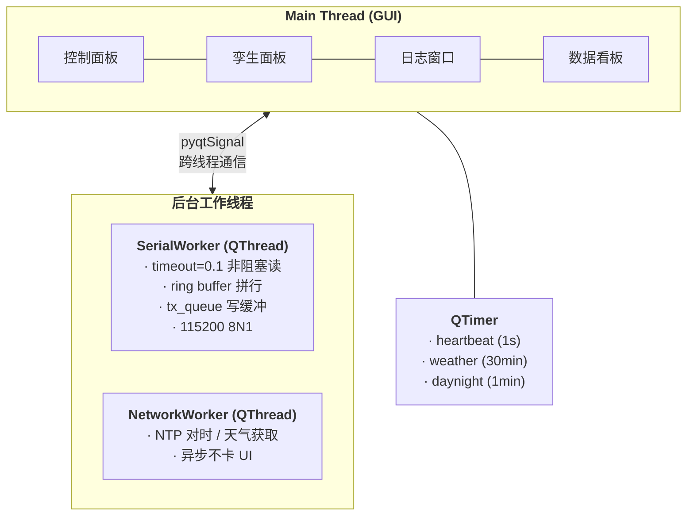

| 线程 | 职责 | 关键参数 |
|------|------|----------|
| **Main** | GUI 渲染、控件交互、协议派发 | 永不阻塞 |
| **SerialWorker** | 串口 `readline` 循环 + 写队列 | `timeout=0.1`, ring buffer 拼行 |
| **NetworkWorker** | NTP / HTTP 请求（按需创建） | `timeout=3s`, 用完即销毁 |

> ⚡所有串口 I/O 与网络请求均在子线程执行，通过 `pyqtSignal` 跨线程通知 UI。高频 `*EVT:DISP` / `*EVT:LED` 1Hz 心跳不拖累界面刷新。

### 信号流

```
SerialWorker.line_received(str)  ──▶  MainWindow.on_received()
                                         ├─ 协议解析 handle_protocol_line()
                                         ├─ 孪生面板更新 twin.update_digits/leds
                                         ├─ 日志着色 add_log()
                                         └─ 状态栏刷新 update_status()

SerialWorker.connection_changed(bool) ──▶  连接指示灯 + 按钮文本切换
SerialWorker.latency_updated(int)    ──▶  延迟显示更新
SerialWorker.error(str)              ──▶  弹窗 + 红色日志 + 控件禁用
```

---

## 2. 工程文件清单

```text
pc_host/
├── ui/
│   └── main_window.ui              # Qt Designer 设计文件
├── images/                         # 运行截图
├── main.py                         # ★ 程序入口，MainWindow + AppState
├── ui_main_window.py               # pyuic5 自动生成的 UI 类
├── serial_worker.py                # C1: QThread 后台串口收发
├── protocol.py                     # 协议拼接/解析/心跳过滤/按键别名
├── twin_panel.py                   # C3: 数字孪生镜像面板
├── ntp_helper.py                   # E1: NTP 对时
├── weather_helper.py               # E2: wttr.in 天气获取 + 条件映射
├── astral_helper.py                # E3: Astral 日出日落计算
├── chart_widget.py                 # E4: Matplotlib 三图并列看板
├── log_store.py                    # events.csv 持久化存储
├── requirements.txt                # 依赖清单
└── run_host.bat                    # Windows 一键启动脚本
```

---

## 3. 快速启动

### 环境要求

| 项目 | 最低版本 |
|------|----------|
| Python | 3.8+（开发用 **3.11**） |
| PyQt5 | ≥ 5.15 |
| pyserial | ≥ 3.5 |

### 安装与运行

```powershell
# 1. 进入目录
cd D:\hw26-0013\pc_host

# 2. 激活虚拟环境（推荐）
.\.venv\Scripts\activate

# 3. 安装依赖（首次）
pip install -r requirements.txt

# 4. 启动上位机
python main.py
```

### 启动后操作

| 步骤 | 操作 | 观察点 |
|:--:|------|--------|
| 1 | 下拉框选择 COM 口 | 自动优先选中 USB/CH340 串口 |
| 2 | 点击 **打开** | 状态栏变绿 · 心跳延迟出现 · 孪生面板同步 |
| 3 | S800 上电 | 孪生面板随开机画面逐帧刷新 |

---

## 4. 功能模块技术详解

### C1 · 串口管理

| 属性 | 说明 |
|------|------|
| **实现文件** | `serial_worker.py` — `SerialWorker(QThread)` |
| **UI 组件** | 端口下拉框 · 波特率下拉框 · 连接指示灯 · 延迟标签 |

#### 串口扫描

```
启动 / 点击 Refresh → serial.tools.list_ports.comports()
                     → 过滤 description 含 "USB" 或 "CH340" 的端口
                     → 自动置为首选（若无则保留 COM9 占位）
```

#### 心跳与离线检测

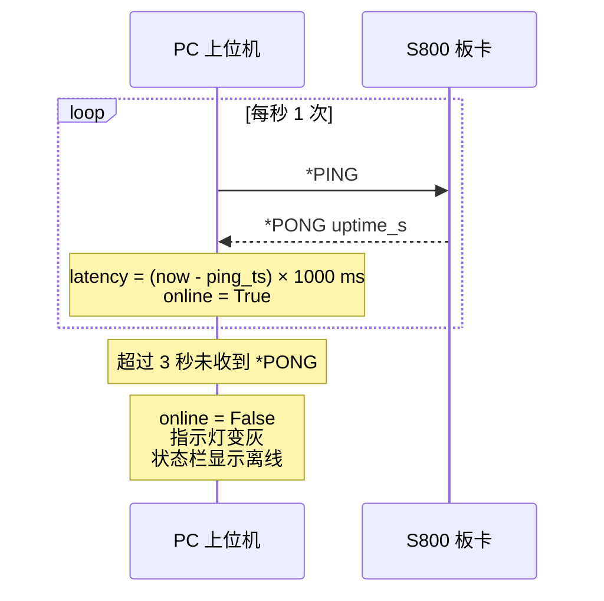

| 事件 | 行为 |
|------|------|
| `*PONG` 到达 | `online=True`, `latency = (now - last_ping_time) × 1000 ms` |
| 3 秒无 `*PONG` | `online=False`, 指示灯变灰, 状态栏显示"离线" |


#### 技术细节

| 项目 | 值 / 策略 |
|------|-----------|
| 读超时 | `timeout=0.1`（非阻塞，避免卡死 read 循环） |
| 写缓冲 | `queue.Queue`（线程安全，`write_line` 入队，`run` 消费） |
| 行拼接 | ring buffer `bytearray` + `\n` 分割，兼容 `\r\n` |
| 波特率选项 | 9600 / 57600 / **115200**（默认） |
| DTR/RTS | 主动拉低（`setDTR(False)`, `setRTS(False)`），避免复位 MCU |

- [x] Refresh 按钮可更新拔插后的 COM 列表
- [x] 断开 USB 后状态灯 **立即变灰**
- [x] write 与 read 在不同线程，UI 永不卡顿

---

### C2 · 控制面板

| 属性 | 说明 |
|------|------|
| **实现文件** | `main.py` — `build_core_tab()` / `build_protocol_tab()` |
| **UI 组件** | QTabWidget（控制 / 数据）→ QScrollArea → QGroupBox 分组 |

#### 控件-协议映射总表（12 条指令全覆盖）

| 分组 | 控件 | 下发协议 | 查询协议 |
|------|------|----------|----------|
| **日期** | 3× SpinBox (Y/M/D) + 组合下拉框 | `*SET:DATE <组合> <值>` | `*GET:DATE` |
| **时间** | 3× SpinBox (H/M/S) | `*SET:TIME HOUR MIN SEC hh mm ss` | `*GET:TIME` |
| **闹钟** | 3× SpinBox + 关闭按钮 | `*SET:ALARM HOUR MIN SEC ...` / `*SET:ALARM OFF` | `*GET:ALARM` |
| **显示** | QRadioButton ON/OFF（立即下发） | `*SET:DISPLAY ON` / `OFF` | `*GET:DISPLAY` |
| **方向** | QRadioButton LEFT/RIGHT（立即下发） | `*SET:FORMAT LEFT` / `RIGHT` | `*GET:FORMAT` |
| **消息** | QLineEdit (≤32 字符) + 发送按钮 | `*SET:MSG <text>` | — |
| **蜂鸣** | QSpinBox (0–9999 ms) + 蜂鸣按钮 | `*SET:BEEP <ms>` | — |
| **LED** | QLineEdit (hex2) + 设置按钮 | `*SET:LED <hex2>` | — |
| **复位** | QPushButton（含 QMessageBox 确认弹窗） | `*RST` | — |
| **虚拟按键** | 孪生面板 10 个 QPushButton | `*SET:KEY <NAME>` | — |
| **昼夜** | 强制白天/夜间 + 自动复选框 | `*SET:MODE DAY` / `NIGHT` | — |

#### 多参数组合演示（≥6 种）

下拉框 `date_combo` 提供：

| 组合 | 下发示例 | 说明 |
|------|----------|------|
| `YEAR MONTH DATE` | `*SET:DATE YEAR MONTH DATE 2026 06 01` | 全参数（默认） |
| `YEAR DATE` | `*SET:DATE YEAR DATE 2026 01` | 省略月份 |
| `MONTH DATE` | `*SET:DATE MONTH DATE 06 01` | 省略年份 |
| `YEAR` | `*SET:DATE YEAR 2026` | 仅设年 |
| `MONTH` | `*SET:DATE MONTH 06` | 仅设月 |
| `DATE` | `*SET:DATE DATE 01` | 仅设日 |

#### 协议容错演示

| 按钮 | 发送内容 | 验证目标 |
|------|----------|----------|
| **缩写演示** | `*SET:DISP ON` | `DISPlay`→`DISP` 缩写合法 |
| **大小写混合演示** | `*sEt:FoRmAt rIgHt` | 命令/子命令大小写不敏感 |
| **发送原始指令** | 自由输入（如 `*SET:TIME HOUR SEC 12 45`） | 任意组合 |

#### SET 后自动查询

发送 `*SET:FORMAT` / `*SET:DISPLAY` / `*SET:ALARM` 后自动补发对应 `*GET`，确保单选按钮与状态栏即时反映新值。

---

### C3 · 数字孪生镜像面板（核心）

| 属性 | 说明 |
|------|------|
| **实现文件** | `twin_panel.py` — `TwinPanel` / `SevenSegmentDigit` / `LedIndicator` |
| **UI 组件** | 8 位 QWidget 自绘 7SEG + 8 个 QLabel LED + 10 个 QPushButton |

#### 3.1 七段数码管 (7SEG) — `SevenSegmentDigit`

```
┌─────────────────────────────────────────┐
│  paintEvent(QPainter)                   │
│                                         │
│  每段 = QPainter.drawRoundedRect()      │
│                                         │
│         aaaa                            │
│        f    b                           │
│        f    b                           │
│         gggg                            │
│        e    c                           │
│        e    c                           │
│         dddd   ○ dp (drawEllipse)       │
│                                         │
│  段坐标 (相对位置 0.0~1.0):              │
│    a: (0.22, 0.06, 0.56, 0.08)          │
│    b: (0.78, 0.13, 0.08, 0.33)          │
│    c: (0.78, 0.54, 0.08, 0.33)          │
│    d: (0.22, 0.87, 0.56, 0.08)          │
│    e: (0.14, 0.54, 0.08, 0.33)          │
│    f: (0.14, 0.13, 0.08, 0.33)          │
│    g: (0.22, 0.47, 0.56, 0.08)          │
└─────────────────────────────────────────┘
```

| 属性 | 值 / 说明 |
|------|-----------|
| 亮色 (active) | `#FF3030` — 高亮红，模拟真实 LED 数码管 |
| 暗色 (inactive) | `#220000` — 暗红底色，段仍在但不可见 |
| 背景 | `#050505` — 深黑底色 |
| 固定尺寸 | 38×70 px (`QSizePolicy.Fixed`) |
| 字符映射表 | `MAP` 字典覆盖 `0-9`, `A-Z`, `-`, `_`, ` ` 共 38 个字符 |
| 小数点 | `drawEllipse` 右下角，位置 `(0.82w, 0.87h)` |
| 闪烁 | `QTimer` 500ms toggle → `_blink_visible` 控制是否绘制 |

**公开接口：**

```python
digit.set_char(ch: str)               # 设置字符 (取首字 .upper())
digit.set_dp(on: bool)                # 小数点亮灭
digit.set_blink(on: bool, period=500) # 闪烁开关
digit.set_value(ch: str, dp: bool)    # 字符+小数点同时设置
```

#### 3.2 LED 指示灯 — `LedIndicator`

| 属性 | 说明 |
|------|------|
| 实现 | 30×30 QLabel + QSS `qradialgradient` 圆形渐变 |
| 亮态 QSS | `#led_on` — 中心 `#FFFF80` → 边缘 `#FFC800`（暖黄光） |
| 暗态 QSS | `#led_off` — 纯色 `#333`（暗灰） |
| 标注 | 下方显示 `L1\nHB` 格式（编号 + 英文含义） |
| 8 位映射 | `HB` / `ALM` / `EDIT` / `RX/TX` / `SUN` / `RAI/SNO` / `HOT` / `NTP` |

**更新方式：**

```python
# 从 *EVT:LED <hex2> 逐 bit 更新
def update_leds(self, value: int):
    for i, led in enumerate(self.leds):
        led.set_on(bool(value & (1 << i)))
```

#### 3.3 虚拟按键 — 双向联动逻辑

**上行 — 板→PC（*EVT:KEY → 按钮高亮）：**

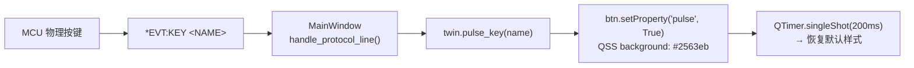

**下行 — PC→板（虚拟按键点击 → *SET:KEY）：**

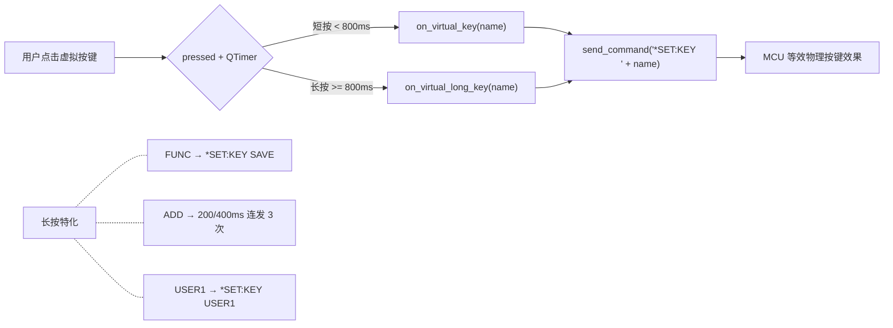

| 机制 | 实现 |
|------|------|
| **短按** | `released` 信号 + 800ms 内未触发长按 |
| **长按** | `pressed` 后 `QTimer.singleShot(800ms)` → `key_long` 信号 |
| **高亮反馈** | `pulse_key()` → QSS `background: #2563eb` 持续 200ms |
| **防环回** | 虚拟按键下行 `*SET:KEY` 后 MCU 不回报 `*EVT:KEY` |
| **FORMAT 特殊处理** | 虚拟按键 FORMAT 后主动补 `*GET:FORMAT` 更新状态栏 |
| **USER1 特殊处理** | 短按 USER1 → PC 直接发起 NTP 对时（不下发 `*SET:KEY`） |

#### 3.4 同步逻辑总表

| MCU 上报 | PC 处理 | 延迟要求 |
|----------|---------|:--:|
| `*EVT:DISP <8字符> <dpHex>` | `twin.update_digits(text, dp)` → 8 位逐字 + bit 解码小数点 | < 200ms |
| `*EVT:LED <hex2>` | `twin.update_leds(int(hex2, 16))` → 8 位逐 bit 亮灭 | < 200ms |
| `*EVT:KEY <NAME>` | `twin.pulse_key(name)` → 对应按钮 200ms 高亮 | < 200ms |
| `*EVT:MODE NIGHT` | 仅保留时分 4 位 7SEG + LED 仅心跳 → 孪生面板同步变暗 | < 200ms |

#### 3.5 全量心跳校准

`*EVT:DISP` 与 `*EVT:LED` **每秒发送一次**（即使内容无变化）。PC 端：

- 每次收到即完整覆盖显示/LED 状态
- 任何单次丢包在下一秒自动修正
- **无需重传机制**，天然容错

#### 3.6 夜间模式自适应

```
收到 *EVT:MODE NIGHT →
  · 7SEG：仅前 4 位更新（时+分），后 4 位显示空白
  · LED：仅 L1(HB) 保持心跳闪烁，其余全部熄灭
  · 孪生面板自动跟随（与 S800 实物一致）

收到 *EVT:MODE DAY →
  · 7SEG：恢复完整 8 位
  · LED：全部恢复正常指示
```

- [x] PC 镜像面板显示与 MCU 实物一致（同框拍摄验证）
- [x] 镜像面板点击 FUNC → MCU 进入编辑模式
- [x] MCU 按下 USER2 → PC 端 USER2 按钮同步高亮 200ms
- [x] 拔掉串口线后镜像面板停止刷新，不崩溃不报错

---

### C4 · 四色收发日志

| 属性 | 说明 |
|------|------|
| **实现文件** | `main.py` — `build_log_panel()` / `add_log()` |
| **UI 组件** | `QPlainTextEdit` (只读) + `QCheckBox` (心跳过滤) + 导出/清空按钮 |

#### 颜色编码表（严格四色 + 系统色）

| 类型 | 颜色 | 色号 | 说明 | 示例 |
|:--:|------|:--:|------|------|
| **TX** | 🔵 蓝 | `#0064C8` | PC 发送的指令 | `-> *SET:TIME HOUR MIN SEC 12 30 45` |
| **RX** | 🟢 绿 | `#009600` | MCU 返回的 OK 应答 | `<- OK 12.30.45` |
| **EVT** | 🟣 紫 | `#9600C8` | MCU 主动上报的事件 | `<- *EVT:KEY USER2` |
| **ERR** | 🔴 红 | `#C80000` | 错误 / 异常 | `<- ERROR PARAM` / `serial error: ...` |
| **SYS** | ⚪ 灰 | `#888888` | PC 本地系统信息 | `NTP sync aliyun delta 12 ms` |

#### 日志特性

| 特性 | 实现 |
|------|------|
| **时间戳格式** | `[HH:MM:SS.fff]` — 精确到毫秒 |
| **自动滚动** | 仅当用户停留在底部时自动跟随；向上翻阅历史时保持当前位置 |
| **最大行数** | `setMaximumBlockCount(1000)` — 超过自动丢弃最早行 |
| **心跳过滤** | `QCheckBox "显示心跳"` 默认关闭，过滤 `*PONG` / `*EVT:DISP` / `*EVT:LED` |
| **导出** | `QFileDialog` → 保存为 UTF-8 TXT 文件 |
| **清空** | `log.clear()` 即时清空 |

#### 心跳过滤逻辑 (`protocol.is_heartbeat`)

```python
def is_heartbeat(line: str) -> bool:
    return line.startswith("*PONG") \
        or line.startswith("*EVT:DISP") \
        or line.startswith("*EVT:LED")
```

- [x] 协议方向、颜色、时间戳均准确无误
- [x] 高频事件发生时日志滚动流畅不卡顿
- [x] 关闭"显示心跳"后业务日志清晰可见

---

### E1 · NTP 网络对时

| 属性 | 说明 |
|------|------|
| **实现文件** | `ntp_helper.py` / `main.py` — `ntp_sync()` |
| **分值** | +2 |

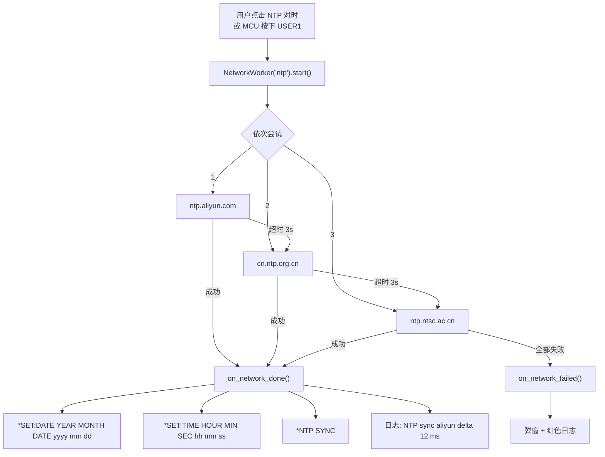

| 关键设计 | 说明 |
|----------|------|
| 异步 | `NetworkWorker(QThread)` — 不阻塞 UI |
| 容错 | 3 个 NTP 服务器依次尝试 |
| 超时 | `timeout=3s`，超时后弹窗提示 |
| LED 指示 | MCU LED8 同步后常亮，超 24h 未同步慢闪 |

---

### E2 · 天气获取

| 属性 | 说明 |
|------|------|
| **实现文件** | `weather_helper.py` / `main.py` — `fetch_weather()` |
| **分值** | +3 |

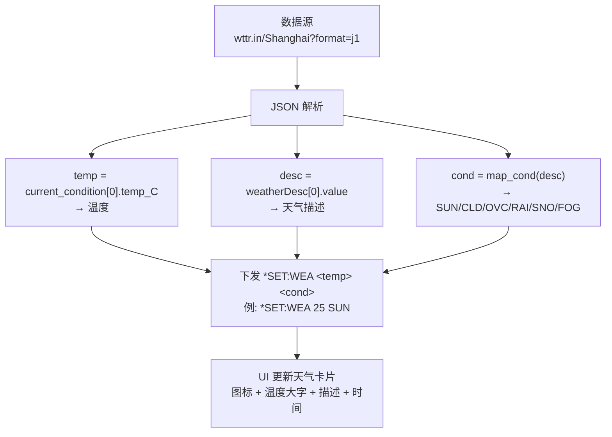

#### 天气映射表

| wttr.in 原文 | 缩写 | 图标 |
|-------------|:--:|:--:|
| Sunny / Clear | `SUN` | ☀ |
| Partly cloudy / Cloudy | `CLD` | ⛅ |
| Overcast | `OVC` | ☁ |
| Rain / Light rain / Heavy rain | `RAI` | 🌧 |
| Snow / Light snow | `SNO` | ❄ |
| Fog / Mist | `FOG` | 🌫 |

**默认回退**：无法匹配的天气描述统一映射为 `CLD`。

#### 调度策略

| 时机 | 说明 |
|------|------|
| 启动后 1 秒 | `QTimer.singleShot(1000, ...)` 首次拉取 |
| 每 30 分钟 | `QTimer` 自动刷新 |
| 手动 | 点击「立即更新」按钮 |

#### MCU 联动

- LED5 (SUN) 亮 = 晴；LED6 (RAI/SNO) 慢闪 = 雨/雪；LED7 (HOT) 亮 = 温度 ≥ 30°C
- 按 S800 板 USER2 → 数码管短显天气 5 秒（如 `25C_SUN_`）
- 短显期间 `*EVT:DISP` 照常上报，PC 镜像自动跟随

---

### E3 · 自动昼夜模式

| 属性 | 说明 |
|------|------|
| **实现文件** | `astral_helper.py` / `main.py` — `auto_daynight()` |
| **分值** | +1 |

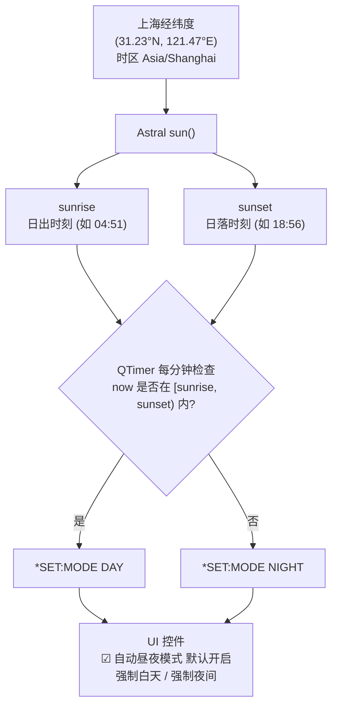

| 模式 | MCU 行为 | PC 镜像 |
|------|----------|---------|
| **DAY** | 8 位全显 + LED 全启用 + 蜂鸣器正常 | 孪生面板全组件激活 |
| **NIGHT** | 仅显时分 4 位 + LED 仅心跳 + 蜂鸣抑制 | 孪生面板同步变暗 |

#### UI 信息栏

| 组件 | 内容 |
|------|------|
| `sun_label` | `日升 / 日落: 04:51 / 18:56` |
| `mode_label` | `当前模式: DAY` / `NIGHT` |
| `auto_mode_check` | 自动切换开关 |

---

### E4 · 数据可视化看板

| 属性 | 说明 |
|------|------|
| **实现文件** | `chart_widget.py` / `log_store.py` / `main.py` — `build_data_tab()` |
| **分值** | +1 |

#### 数据持久化 (`log_store.py`)

```csv
timestamp,type,data
2026-06-10 12:30:45.123,ALARM,12.30.45
2026-06-10 12:00:00.456,SYNC,delta 12
2026-06-10 12:35:00.789,EDIT,TIME 12.35.00
2026-06-10 12:35:01.012,KEY,USER1
2026-06-10 13:00:00.345,WEATHER,25 SUN
```

| 事件类型 | 触发时机 |
|----------|----------|
| `ALARM` | `*EVT:ALARM` 上报 |
| `SYNC` | NTP 对时完成 |
| `EDIT` | `*EVT:EDIT` 上报 |
| `KEY` | `*EVT:KEY` 上报 |
| `DISP` | `*EVT:DISP` 上报（仅记录文本） |
| `LED` | `*EVT:LED` 上报 |
| `WEATHER` | 天气获取成功 |

#### 三张并列图表 (`chart_widget.py`)

| 图表 | 类型 | X 轴 | Y 轴 | 说明 |
|------|:--:|------|------|------|
| **Alarm by Hour** | 柱状图 | 小时 (0-23) | 闹钟触发次数 | 统计各时段闹钟频率 |
| **NTP Delta (ms)** | 折线图 | 时间序列 | 对时偏差 (ms) | 反映本地时钟漂移 |
| **Key Heat** | 条形图 | 按键名 | 按压次数 | 10 种按键热度统计 |

**技术实现：**
- 使用 `matplotlib.backends.backend_qt5agg.FigureCanvasQTAgg` 嵌入 Qt 界面
- 数据源自 `EventStore.rows()` → 读取 `events.csv`
- 支持「刷新图表」+「导出 CSV」按钮
- 数据为空时图表显示占位提示，不崩溃

---

## 5. 异常处理与防崩溃机制

### 🛡️ 顶层兜底

```python
def install_excepthook():
    """全局未捕获异常 → QMessageBox.critical 弹窗 + stderr 输出"""
    def hook(exc_type, exc, tb):
        message = "".join(traceback.format_exception(exc_type, exc, tb))
        sys.stderr.write(message)
        try:
            QMessageBox.critical(None, "意外错误", str(exc))
        except Exception:
            pass
    sys.excepthook = hook
```

### 异常场景处理表

| # | 异常场景 | 处理方式 | 用户感知 |
|:--:|----------|----------|----------|
| 1 | **串口被占用** | `SerialWorker.run()` 中 `serial.Serial()` 抛异常 → `error.emit()` → 弹窗 + 禁用控件 | 🔴 模态弹窗："open COM9 failed: ..." |
| 2 | **写入失败** | `SerialWorker.run()` 中 `write()` 抛异常 → `error.emit()` + break 退出线程 | 🔴 红色日志 + 状态栏提示 + 自动断开 |
| 3 | **MCU 回应 ERROR** | `handle_protocol_line()` 检测 `line.startswith("ERROR")` → `status.showMessage(line)` | 🔴 红色日志 + 状态栏显示错误原文 |
| 4 | **协议解析异常** | `on_received()` 中 `handle_protocol_line()` 被 try/except 包裹 → `[PARSE ERR]` 日志 | 🔴 红色日志：`[PARSE ERR] <原始行> (<异常信息>)` |
| 5 | **消息含非 ASCII** | `send_command()` 中 `any(ord(ch) > 127 for ch in line)` → `QMessageBox.warning` | 🟡 模态弹窗："协议文本必须为 ASCII 字符。" |
| 6 | **网络超时 (NTP)** | `ntplib.NTPClient().request()` 超时 3s → 尝试下一服务器 → 全部失败则 `RuntimeError` | 🔴 弹窗 + 红色日志："ntp failed: ..." |
| 7 | **网络超时 (天气)** | `requests.get()` 超时 5s → `Exception` → `on_network_failed` | 🔴 弹窗 + 红色日志："weather failed: ..." |
| 8 | **心跳超时** | `heartbeat_tick()` 中 `time.time() - last_pong_time > 3.0` → `online=False` | ⚪ 指示灯变灰 + 状态栏"离线" |
| 9 | **未连接时发指令** | `send_command()` 中检测 `worker is None or not running` | 🔴 红色日志："not connected" |
| 10 | **昼夜计算异常** | `auto_daynight()` 中 try/except 包裹 astral 调用 | 🔴 红色日志："day/night failed: ..." |
| 11 | **CSV 写入失败** | `EventStore.append()` 依赖文件系统，异常由调用方捕获 | 🔴 红色日志 |
| 12 | **窗口关闭** | `closeEvent()` 中主动调用 `worker.close()` → 等待 1.5s 线程结束 | 优雅退出，不留僵尸线程 |

### 控件禁用逻辑

```
串口打开失败 / 连接断开后:
  → set_controls_enabled(False)
  → control_tabs.setEnabled(False)  (控制面板)
  → twin.setEnabled(False)          (孪生面板按键)
  → 防止用户误操作

连接成功后:
  → set_controls_enabled(True)
  → 全部功能恢复
```

---

## 6. 运行截图说明

### 6.1 主界面全貌

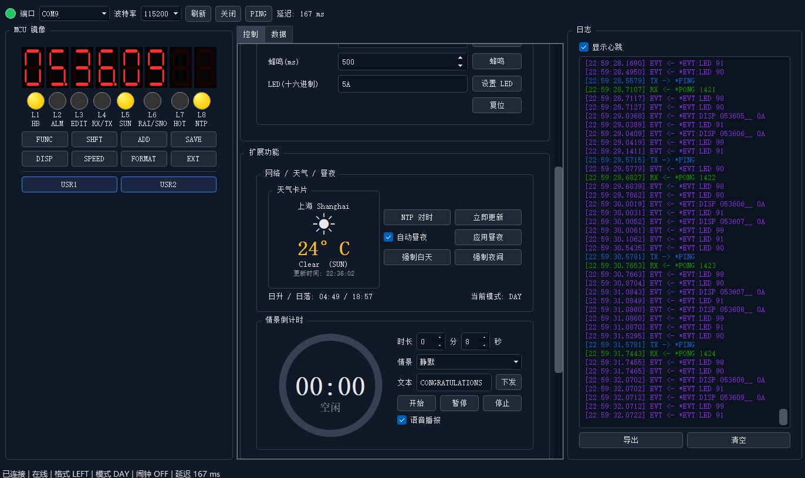

**图 1：PC 上位机主界面** — 左侧数字孪生镜像面板（8SEG + 8LED + 10按键），中间控制面板（核心/扩展/协议三Tab），右侧四色日志窗口。底部状态栏显示连接状态、FORMAT、MODE、ALARM、延迟。

---

### 6.2 数字孪生面板特写

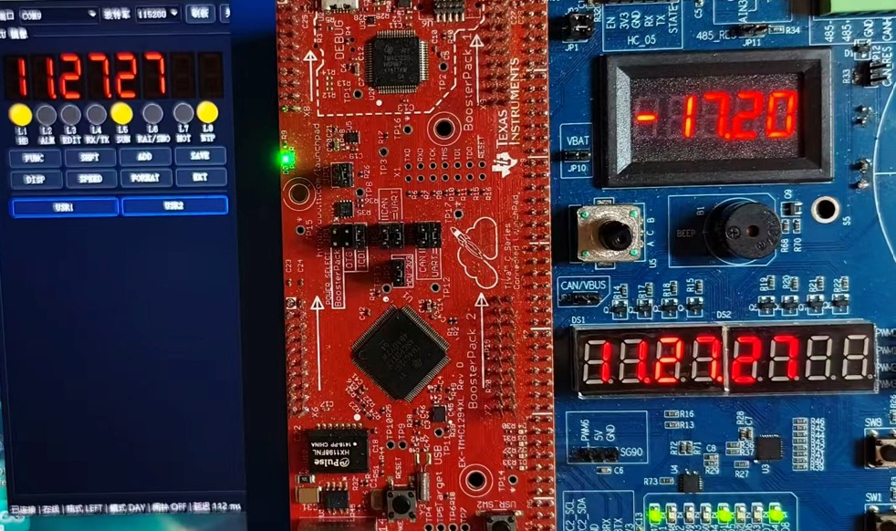

**图 2：数字孪生面板与 S800 实物同框** — 左侧 PC 镜像面板，右侧 S800 板卡实物。两者 7SEG 显示内容、LED 亮灭状态完全一致，验证双向同步。

---

### 6.3 数据可视化看板

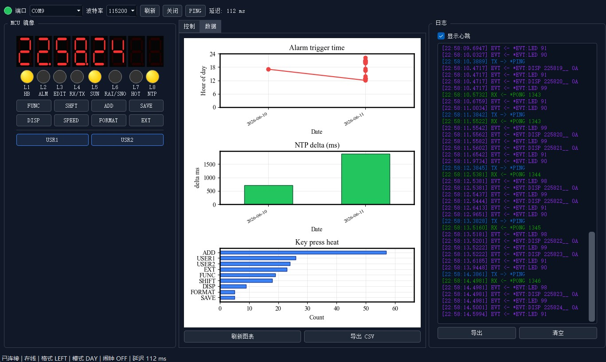

**图 3：数据可视化看板** — 三张 Matplotlib 图表并列展示：Alarm by Hour（柱状图）、NTP Delta（折线图）、Key Heat（条形图）。底部有「刷新图表」和「导出 CSV」按钮。

---

### 6.4 错误弹窗提示

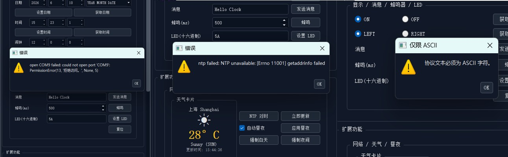

**图 4：异常处理弹窗** — 左侧：串口占用时的错误弹窗；中间：网络超时弹窗；右侧：ASCII 校验拦截弹窗。

---

### 6.5 协议容错演示

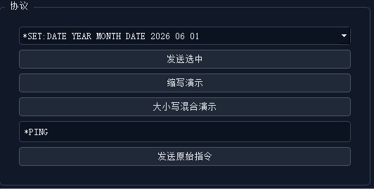

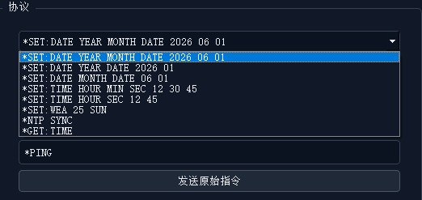

**图 5：协议面板** — 多参数组合下拉框（6 种）、缩写演示按钮、大小写混合演示按钮、原始指令输入框。

---


## 📦 依赖清单

```ini
# 核心
PyQt5 >= 5.15
pyserial >= 3.5

# 扩展
ntplib >= 0.4.0
requests >= 2.28
astral >= 3.2
matplotlib >= 3.5
```

完整版本见 `requirements.txt`。

---